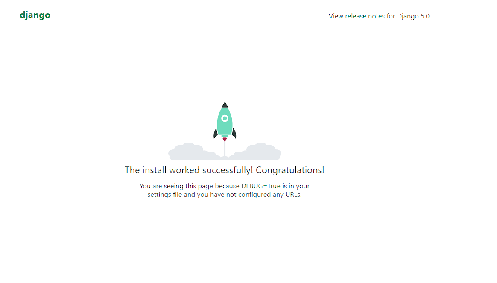

# This is Tik's Blog in DJANGO

-- pip3 install Django

-- django-admin startproject tik_blog .
-- django-admin startproject tik_blog .
-- python manage.py runserver

python manage.py startapp blog

-- add blog to settings.py

-- creatges post in models.py of blog

-- python manage.py migrate blog
-- python manage.py migrate
-- python manage.py createsuperuser

CI DC:https://medium.com/intelligentmachines/github-actions-end-to-end-ci-cd-pipeline-for-django-5d48d6f00abf